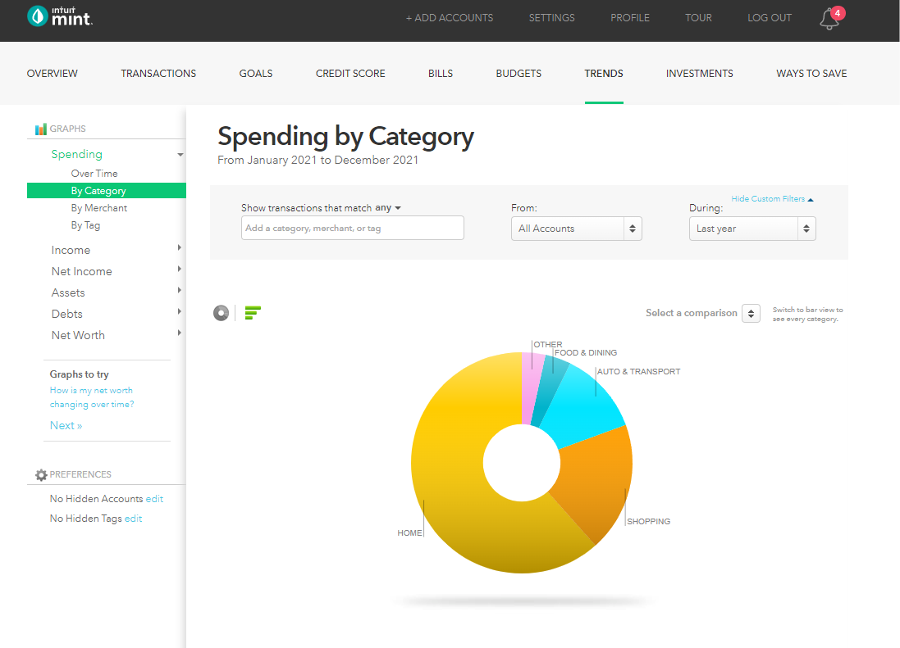

# **Finances 101**

# Table of Contents

# Fundamentals

## ALWAYS Do the Thing That Makes Sense
Always take win-win situations. Always take no lose situations. There's surprisingly a lot of these situations in life that we don't take. Things like getting a [good credit score](#credit-and-debt), calling around to get deals on insurance, taking a [401k match](#-tax-advantaged-investing), and applying for scholarships are all examples of things that have great upside and little downside.

However, a lot of people don't do these things, either because they are lazy, scared of rejection, or they would have to be in an uncomfortable situation. Consistently doing the things that make sense over the course of a lifetime will put you miles ahead of others.

## The Power of Money
- Leverage - money allows you to make decisions from a position of strength. For example: It's a lot easier to find your dream job when you can afford to be unemployed for a few months. 
- Time - You spend a large portion of your life exchanging time, the most precious resource you have, for money. With wise financial decisions you can minimize the amount of time you waste slaving away for corporate overlords.
- Like literal survival - food, water, shelter. These things cost money

## Credit and Debt

## Track Your Money
What gets measured, gets managed. Track your spending, savings and investments. I recommend using [Mint](https://mint.intuit.com/overview.event), it can track spending, investments, bank accounts, credit score and more, you can also make budgets, view trends etc. It will also alert you with any unusual behavior.

# Investing

## Simple version of how to invest
Set up an investment account with [Vanguard](https://personal1.vanguard.com/mmx-move-money/welcome) and set up automatic transactions to regularly put in a set amount of money into an investment account that tracks the [S&P 500](#sp-500). For Vanguard, the the fund that tracks the S&P 500 is VFIAX.

## Why? aka the long version
Historically the S&P 500 has returned ~11% each year (7% increase in purchasing power if you adjust for inflation). 2021 returned 26.8%. That means if you had invested 100k on January 1, 2021 you would have made $26,800 that year. $26,800 in free money. But that is just one year, we haven't even gotten to compound interest.

Compound Interest Baby. Imagine you invest $100k. Now every year you make roughly $11k in free money. But it's even better than that. Because after the first year, now you have $111k invested. So making 11% of that the second year makes you $12.2k. and the year after that: $13.6k and so on and so forth.

Doubling time is a good way to get a grasp of how wild compound interest is. Assuming a rate of increase of 11%, your money will double every 6.6 years. You have 100k invested, in 6.6 years you now have 200k; in 13.2 years, 400k; 19.8 years, 800k; 26.4 years 1.6 MILLION FUCKING dollars. and so on. Insane. So needless to say, you want to invest as MUCH as possible as SOON as possible, because your money will be worth exponentially more the longer it is invested.

You cannot afford to not invest. If you put $200 in your savings account every month, in 30 years you will have saved a whopping total of $72,000. If you have invested in the S&P 500 you will have about $400,000 at the end of 30 years.

## Saving and Deferring Spending
AKA Live like a bum now to live like a king later (or just retire sooner)

## Index Funds
An index fund is a type of [mutual fund](#mutual-funds) or exchange-traded fund ([ETF](#etfs)) with a portfolio constructed to match or track the components of a financial market index, such as the Standard & Poor's 500 Index (S&P 500). This is different from a mutual fund which is managed by a human.

## Mutual funds
## ETFs
An ETF (exchange-traded fund) is a collection of hundreds or thousands of stocks or bonds, managed by experts, in a single fund. It is bought as a single, whole share. For example: if one share costs $400 you cannot buy $200 worth of that ETF)

## S&P 500

## Tax-Advantaged Investing
---
401k
- Always take employer match
- Pre-tax contributions
- Pay taxes later

Roth IRA
- Post tax contributions
- $6k limit per year
- Don't have to pay taxes after
- Mega backdoor roth

# Taxes
## Income Tax
https://smartasset.com/taxes/california-paycheck-calculator
## Capital Gains Tax
## Write-offs
Capital loss

# Retiring Early
Crossover point - This is when your passive income from investments equals your expenses. When you reach that point – DingDing! – you are Financially Independent.

# Buying a House (work in progress)
## Escrow
## Agents
### Redfin